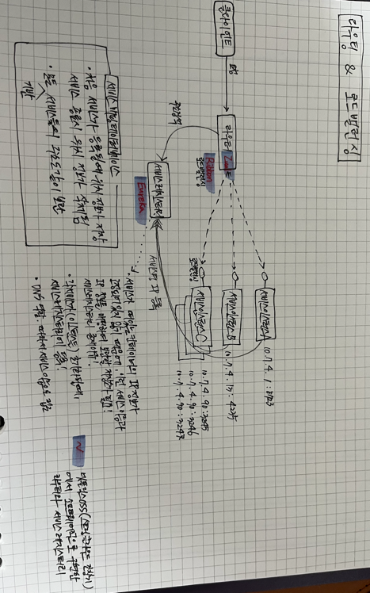

서비스 A 에서 서비스 C 로의 호출시, 다이렉트로 호출하지 않음. 반드시 API 게이트웨이를 거쳐 서비스 C 를 호출하게 된다.
API 게이트웨이는 서비스가 어디떠있는지 알아야되니, 서비스레지스트리(유레카)에 물어봄!

그 결과 C 라는 서비스가 세개 떠있다는 것을 API 게이트웨이는 알게되고, 라우팅함과 동시에 서비스 세개 중 제일 한가한 놈으로 로드밸런싱 !

현재 그림에는 예전 스프링클라우드 작동방식(넷플릭스 OSS)를 사용하여 소프트웨어적으로 구현한 것이다. 현재는 (2022년 기준) 쿠버네티스에 많이 올리는 추세이며, 
각 서비스 인스턴스(A. B, C) 는 Pod 가 되고, 특히 서비스 C 의 경우 레플리카 셋을 3 으로 한 Pod 가 된다.

또한 API 게이트웨이도 Pod 로 만들 수 있다. 서비스레지스터리 또한 Pod 로 만들수 있다.

그런데 재미있게도, 쿠버네티스는 서비스디스커버리, 라우팅, 로드밸런싱을 "서비스" 라는 오브젝트가 해준다. 

쿠버네티스를 사용하면 굳이 별도로 만들 필요 없이 서비스 자체로 제공해주기 때문에 인기가 많은 것.

