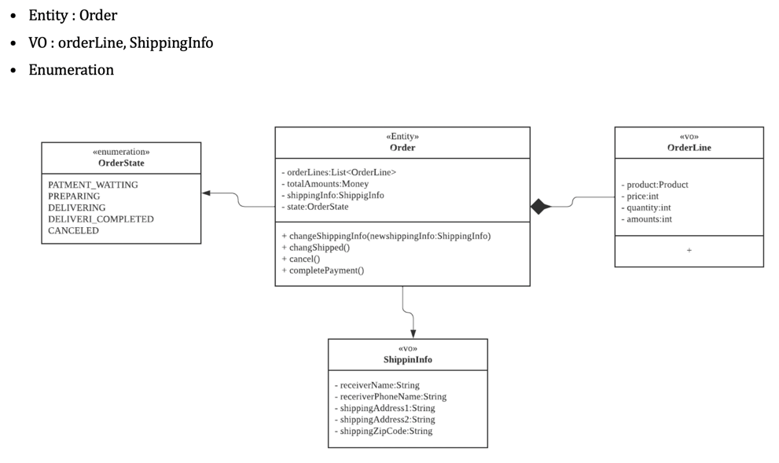
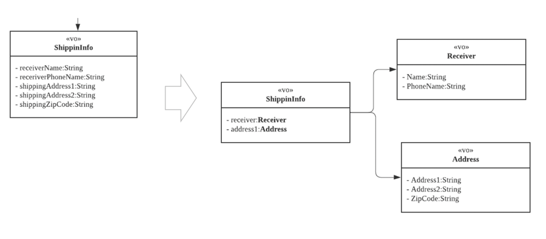
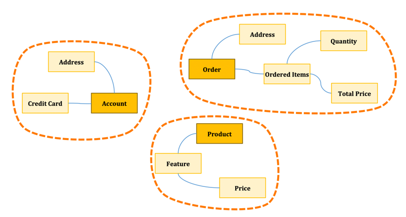
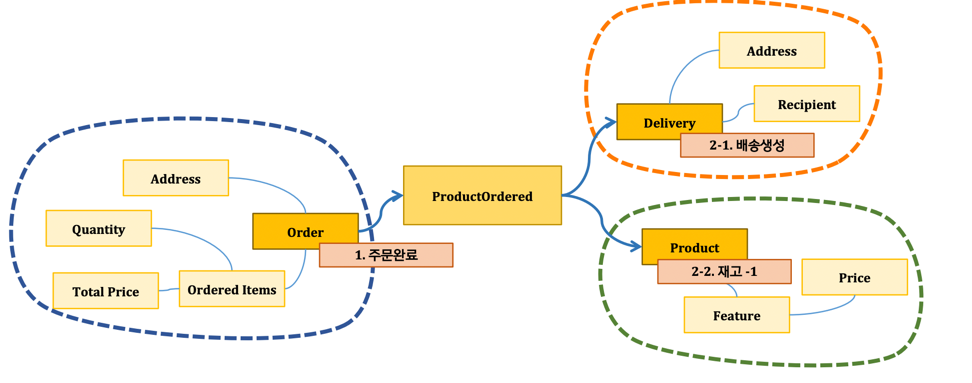
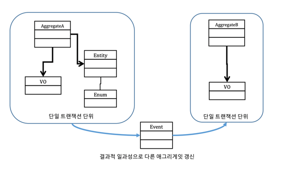
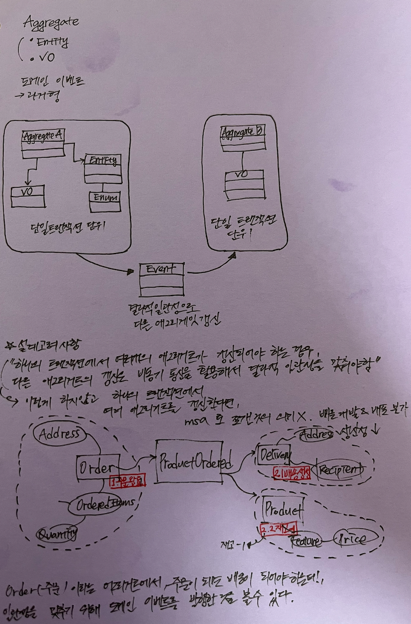
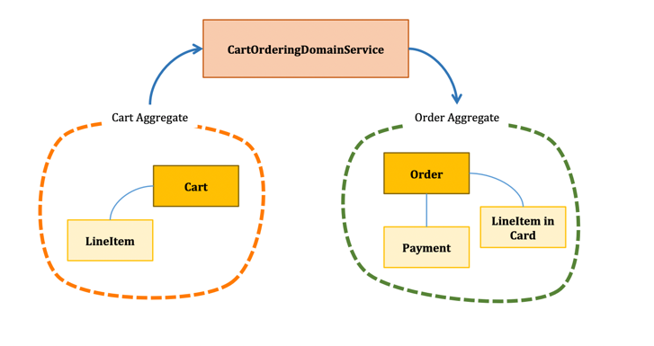

마이크로 서비스 내의 비즈니스 로직을 구현하는 것이 패턴화 되어있다.

가장 전통적인 방법은 트랜잭션 스크립트 패턴.
## 1. 트랜잭션 스크립트 패턴

가장 익숙한 패턴이다. 응용 서비스단에서 트랜잭션 단위로 데이터베이스에 쿼리를 날리는 방식. 특징은 다음과 같다.
- 주요 장점은 단순, 이해하기 쉬움
- DB 종속될 위험
- 복잡한 비즈니스 로직에 부적합

## 2. 액티브 레코드 패턴
- 엔티티에 간단한 비즈니스 로직을 포함 가능
- 그러나 대부분의 비즈니스 로직은 응용서비스의 행위에 의해 처리
- 빈약한 도메인 모델이라고도 함

## 3. 도메인 모델 패턴
- 복잡한 비즈니스 로직에 적합
- 이미 본질적으로 복잡하므로, 인프라 관심사를 피하는 순수한 POJO 로 작성
- 응용서비스에서는 대부분 업무 흐름만 제어하며 **주요 비즈니스 로직은 도메인 모델에 위임**하여 처리

## 4. 어그리거트 도메인 모델 패턴
- 도메인 모델 패턴 적용시 도메인 모델이 점점 복잡해지고 비대해짐
- 이에 그 복잡성을 관리할 단위를 구분해 냄 (도메인 주도의 Aggregate)
- 대부분 한개의 엔티티와 여러 개의 VO 로 구성

### 애그리거트 도메인모델 패턴 구성요소
#### 1. Value Object
- 고유의 식별자를 가지지 않음
- 원시 속성을 객체로 표현
```java
class Color {
    int red;
    int green;
    int blue;
}

class Name {
    String firstName;
    String lastName;
    
    // ... 유효성 검사 가능
}

class Person {
    private PersonId id;
    private Name name;
    private PhoneNumber phone;
    private EmailAddress email;
}


public static void main(String[] args) {
    new Person(
            new PersonId(32424),
            new Name("seoyeon", "Jang"),
            PhoneNumber.parse("01012344321"),
            Email.parse("test@gmail.com")
    )
}
```
- 명료성 향상, 의도를 명확히 전달
- 유효성 검사 가능 (비즈니스 로직 가능)
- 여러개의 속성을 묶어 하나의 VO 로 (firstName 과 lastName 을 하나의 Name 이라는 객체로)

#### 2. Entity
- 고유 식별자를 갖는 객체
- 예시) 주문, 회원, 상품
- DB 엔티티와의 차이: 행위(기능 제공)



아래와 같이 리팩토링 가능

이렇게 하면, 비즈니스 로직에서 굉장히 가독성 높은 코드를 작성할 수 있음

#### 3. Aggregate
- 애그리거트는 엔티티와 VO 로 이루어져있음
- 관련 객체를 하나로 묶은 군집
- 애그리거트 루트(엔티티)를 통해 애그리거트 냉늬 다른 엔티티 및 VO 접근

- 주황색 네모가 애그리거트 루트
- 데이터 변경위 단위, 트랜잭션 단위가 되는 연관된 객체 묶음
- 즉 어그리거트 단위별로 하나의 트랜잭션
* 설계 고려 사항
  * 하나의 트랜잭션에는 하나의 애그리거트만 수정함
  * 트랜잭션 일관성과 성공을 보장하도록 애그리거트 구성요소들을 설계해야 함
  * 하나의 일을 잘 수행할 수 있도록 작게 설계해야함
  * 작게 설계할수록 성능이 좋고 확장에 용이. 뭐가 됐든 메모리에 로딩되기 떄문.
  * 한 애그리거트에서 다른 애그리거트의 참조는 식별자를 통해서만 참조해야함
  **하나의 트랜잭션에서 여러개의 애그리거트가 갱신되어야 하는 경우, 다른 애그리거트의 갱신은 비동기 통신을 활용해서 \*결과적 일관성을 맞춰야 함**
* 특징
  * 각 애그리거트는 일관성있는 트랜잭션 경계를 형성

> 결과적 일관성: '일관성이 유지되어야 하는 데이터가 일정시간 다른 데이터와 일치하지 않을 수도 있지만 어느 시점이 되면 결국 일치하게 된다'
> 즉 관계형 DB 의 ACID 처럼 바로 원자성을 가지고 일관성을 가지는게 아니라, 일정시간은 일치하지 않지만, "언젠가는" 일치
> 다시 말하자면 비동기 일관성임. 이는 자기 일처리를 하고, 이벤트를 던짐. 자기 일처리 트랜잭션은 끝나지만, 생성된 이벤트를 구독하고 있는 서비스의 트랜잭션이
> 아직 남음. 그래도 이벤트를 가져가면 "언젠가는" 동기화 될 것이라는 게 결과적 일관성이다.

#### 4. 도메인 이벤트
- 비즈니스 도메인에서 일어난 중요한 이벤트를 설명하는 메시지
- '과거형' 으로 명명





#### 5. 도메인 서비스
- 특정 엔티티나 VO 에 속하지 않는 도메인 로직 또는 복수의 애그리거트에 관련된 비즈니스 로직 제공
- 어떤 계산이나 분석을 위해 다양한 시스템 구성요소의 호출을 조율
* 특징
  * 비즈니스 처리를 위해 다수의 애그리거트가 포함되어야 하는 경우 Service 객체를 만들어 처리함


## 5. 이벤트 소싱 패턴
"이력"이 굉장히 중요한 비즈니스일 경우, 트랜잭션 "자체"를 저장해버린다. 객체 모델로 저장 X. 그렇기에 쓰기(write)속도가 굉장히 빨라진다.
어떤시점에 이력인지를 모두 재생하여 볼 수 있기 때문에 이벤트 자체를 이벤트 저장소에 저장을 하고, 그것을 구체화(재생)하여 도메인 모델로 조회하여 보여줄 수있다.


## 정리
마이크로서비스에서 비즈니스 로직을 구현할 때, 위 5가지 패턴을 선택할 수 있어야 한다. 
로직이 심플하고 단순하다면 트랜잭션 고려해볼 수 있고, 복잡하다면 객체를 활용한 도메인 또는 애그리거트 패턴을 쓰는 것이 좋다.
