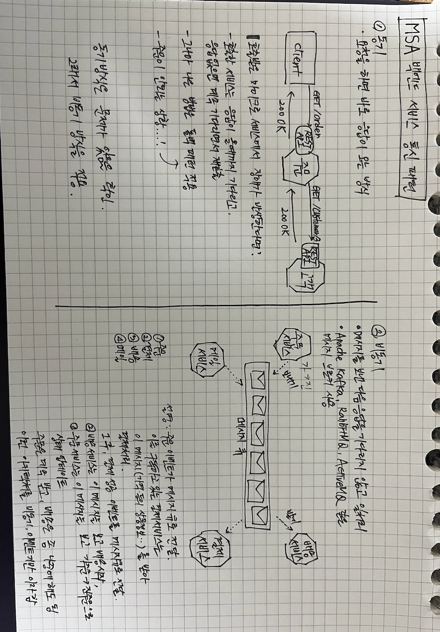
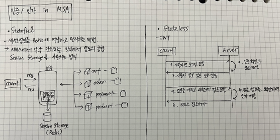

마이크로 서비스 내의 비즈니스 로직을 구현하는 것이 패턴화 되어있다.

가장 전통적인 방법은 트랜잭션 스크립트 패턴.
1. 트랜잭션 스크립트 패턴

가장 익숙한 패턴이다. 응용 서비스단에서 트랜잭션 단위로 데이터베이스에 쿼리를 날리는 방식. 특징은 다음과 같다.
- 주요 장점은 단순, 이해하기 쉬움
- DB 종속될 위험
- 복잡한 비즈니스 로직에 부적합

2. 액티브 레코드 패턴
- 엔티티에 간단한 비즈니스 로직을 포함 가능
- 그러나 대부분의 비즈니스 로직은 응용서비스의 행위에 의해 처리
- 빈약한 도메인 모델이라고도 함

3. 도메인 모델 패턴
- 복잡한 비즈니스 로직에 적합
- 이미 본질적으로 복잡하므로, 인프라 관심사를 피하는 순수한 POJO 로 작성
- 응용서비스에서는 대부분 업무 흐름만 제어하며 **주요 비즈니스 로직은 도메인 모델에 위임**하여 처리

4. 어그리거트 도메인 모델 패턴
- 도메인 모델 패턴 적용시 도메인 모델이 점점 복잡해지고 비대해짐
- 이에 그 복잡성을 관리할 단위를 구분해 냄 (도메인 주도의 Aggregate)
- 대부분 한개의 엔티티와 여러 개의 VO 로 구성

### 애그리거트 도메인모델 패턴 구성요소
#### 1. Value Object
- 고유의 식별자를 가지지 않음
- 원시 속성을 객체로 표현
```java
class Color {
    int red;
    int green;
    int blue;
}

class Name {
    String firstName;
    String lastName;
    
    // ... 유효성 검사 가능
}

class Person {
    private PersonId id;
    private Name name;
    private PhoneNumber phone;
    private EmailAddress email;
}


public static void main(String[] args) {
    new Person(
            new PersonId(32424),
            new Name("seoyeon", "Jang"),
            PhoneNumber.parse("01012344321"),
            Email.parse("test@gmail.com")
    )
}
```
- 명료성 향상, 의도를 명확히 전달
- 유효성 검사 가능 (비즈니스 로직 가능)
- 여러개의 속성을 묶어 하나의 VO 로 (firstName 과 lastName 을 하나의 Name 이라는 객체로)

#### 2. Entity
- 고유 식별자를 갖는 객체
- 예시) 주문, 회원, 상품
- DB 엔티티와의 차이: 행위(기능 제공)



아래와 같이 리팩토링 가능

이렇게 하면, 비즈니스 로직에서 굉장히 가독성 높은 코드를 작성할 수 있음
