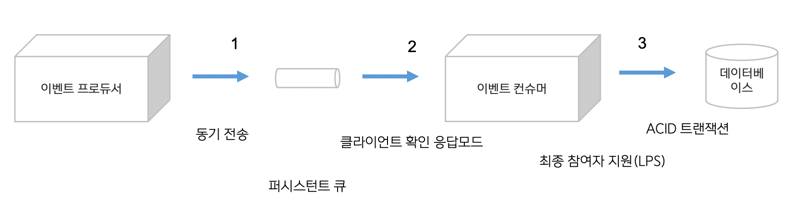
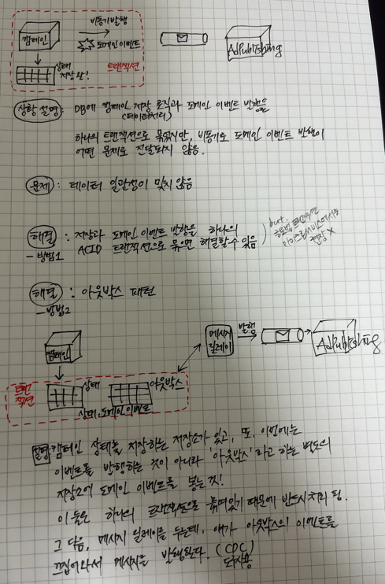
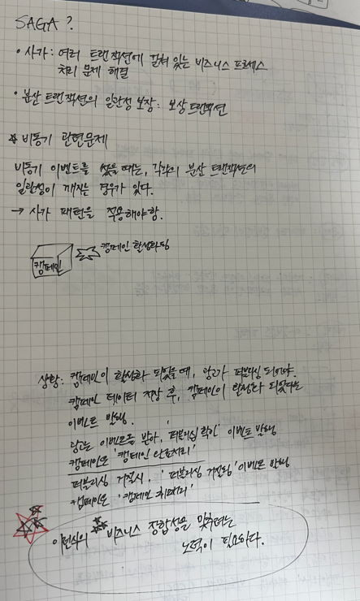

이벤트드리븐 기반의 마이크로서비스는 메시지의 송신자와 수신자가 직접 통신하지 않고 메시지큐를 활용한 비동기 통신 프로토콜을 사용한다.

마이크로서비스간의 통신을 실시간으로 진행되도록 구성한 경우, 장애 발생, 트래픽 증가 등의 이벤트가 발생할 경우 마이크로서비스 오케스트레이션을 
진행하여 확장생성 등의 작업을 수행하게 된다. 이같은 강결합 구조의 실시간 트랜잭션 기반의 서비스를 제공하면, 트랜잭션이 끊어지기 때문에
서비스 요청을 보존할 수 없고 에러가 발생하게 된다.

그래서 서비스 영속성을 지속하기 위해 메시지큐를 활용하는 것을 권장한다.

[데이터 영속성]
기존의 DBMS 를 활용한 ACID 트랜잭션에 따른 데이터무결성은 달성할 수 없으나, 메시지큐를 사용하여 최종적인 일관성 유지가 가능하다.
메시지큐에서는 디스크나 네트워크 메시지 복제본, DBMS 등에 저장하여 메시지의 영속성을 보장한다. 또한 게시자로부터 메시지 전송이 완료되면, 노드나 시스템의 충돌이 발생하여도
대기열에 포함되고 결국에는 Delivery 함으로써 데이터의 영속성을 보장하게 된다.

또한 메시지를 보내고 처리되었음을 보장해주는 방법으로 message 를 처리하는 마이크로서비스에서 confirm 메시지를 보냄으로써 생산자에게 
메시지가 처리되었음을 알려줌으로써 영속성을 보장한다.

하지만 롤백의 경우, 메시지큐는 메시지 재전달을 수행하는 방법과 에러를 발생시키는 방법이 있다. 반드시 롤백을 수행하여야 한다면 모놀리식 아키텍쳐에서는 하나의 트랜잭션에 대해
서 처리를 하기만 하면 됐다면 마이크로서비스에서는 서비스마다 롤백 발생시 처리하는 로직을 개발해야 한다.

[내구성]
내구성을 확보하기 위해 메시지를 메모리, 디스크, DBMS 중 어느 한 곳에 저장해야 한다.
1. 디스크에 저장하는 방법
   - `장점` 메시지를 디스크에 저장할 경우 메시지의 영속성이 보장
   - `단점` 처리속도 느림
2. 데이터베이스에 저장하는 방법
   - `장점` 디스크에서 읽어들이는 방식보다 메모리에 DB 복제본을 두고 메시지를 전송하기떄문에 성능은 향상
   - `장점` 메시지의 내용과 상태확인 용이
   - `단점` 데이터베이스 유지비용, 스토리지 비용 발생.
3. 메모리에 저장하는 방법
   - `장점` 빠름
   - `단점` 메모리는 휘발성이므로 시스템이 다운될 경우 모든 메시지 삭제됨

[비용]
모놀리식 아키텍쳐에서 메시지큐를 활용하지 않았을 경우 하나의 트랜잭션에 대한 네트워크 트래픽이 발생한다. 마이크로서비스에서 메시지큐를 
도입했을때는 네트워크 트래픽이 메시지큐를 한번 더 거쳐서 서비스간의 통신이 발생하기 때문에 네트워크 트래픽 비용이 증가하는 이슈가 발생한다.

[그외 문제점과 주의해야 할 점]
- 매사자 발송 후 수신 실패시 재전송 획수를 정해야하는 등 추가적인 설정 반드시 필요. 재전송 횟수가 많을수록 
    메시지 큐의 성능 저하 및  대기열에 메시지 누적되어 장애 유발가능성이 있기에 적절한 재전송횟수 지정필요
- 반드시 전달되어야 하는 경우 재전송횟수를 늘리기보다는 Error 메시지 출력이나 롤백을 수행할 수 있도록 마이크로서비스를 개발해야 한다.
- 메시지가 메시지큐에서 바로 처리되어야 하는지, 아니면 다수의 큐가 쌓일 때까지 대기했다가 한번에 전송할지 정의해야 한다
- 메시지 순서에 대해 정렬기능은 제공하더라도 전송한 순서와 동일한 순서로 전송되지 않을 수도.
  - 메시지큐는 분산된 메시지큐에 각각 들어가게 되고, 분산된 메시지큐에서는 메시지를 보낼 때 폴링 요청에 먼저 온 메시지큐에서 메시지를 발송하기 때문. (short polling 방식의 경우)

1. 큐에 전달자체가 안됐을 경우
   - 해결: 이벤트 프로듀서에서 큐로의 전달 자체를 "동기" 로 전송하면 된다.
2. 메시지큐 다운
   - 해결: DB 에 저장 등 퍼시스턴스 큐를 사용한다.
3. 이벤트 컨슈머가 메시지를 잘 받았는지 이벤트 프로튜서가 확인 불가
   - 해결: 클라이언트 확인 응답모드 사용
3. 이벤트 컨슈머에서 데이터에러로 인해 메시지 저장 실패
   - 해결: ACID 트랜잭션 사용

[추가적인 비동기 관련 문제]

**문제상황.** 

데이터처리와 이벤트발행을 하나의 트랜잭션으로 묶었더라도, 발행된 이벤트가 여러가지 요인으로 전달되지
않았을 경우 어떻게 일관성을 맞출 수 있는가?
 

